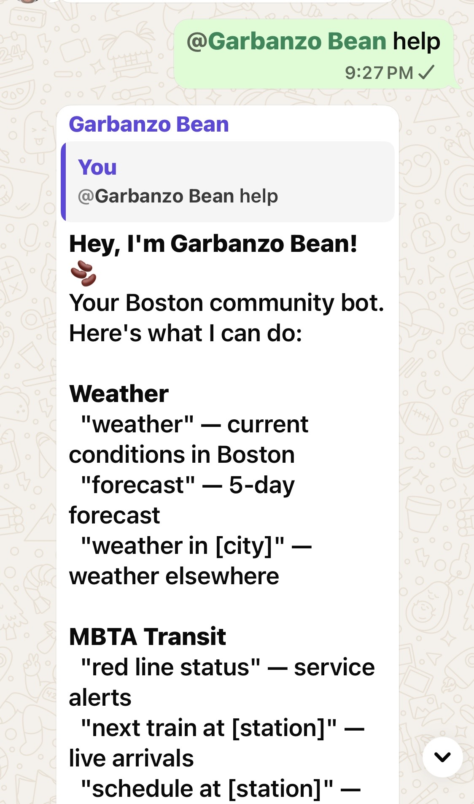
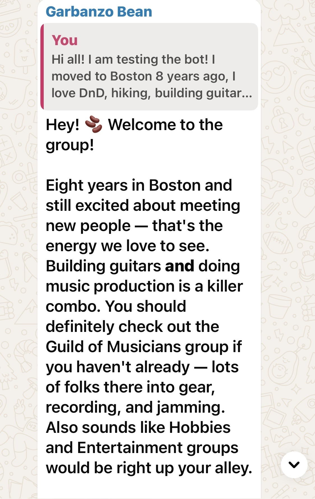
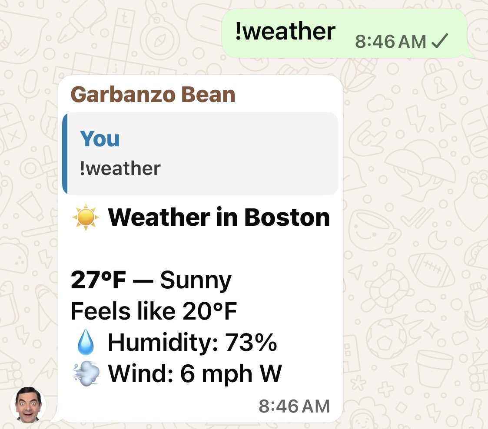
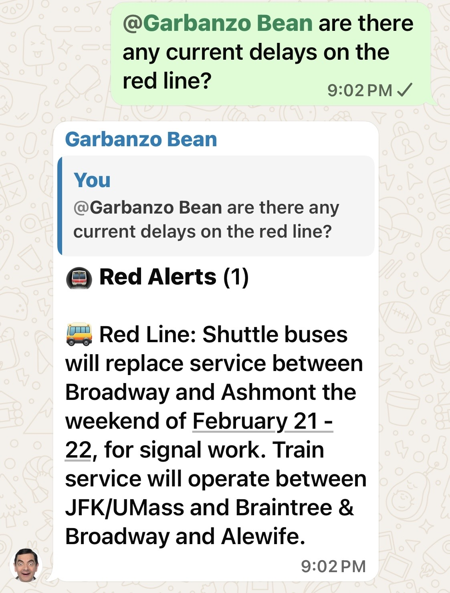
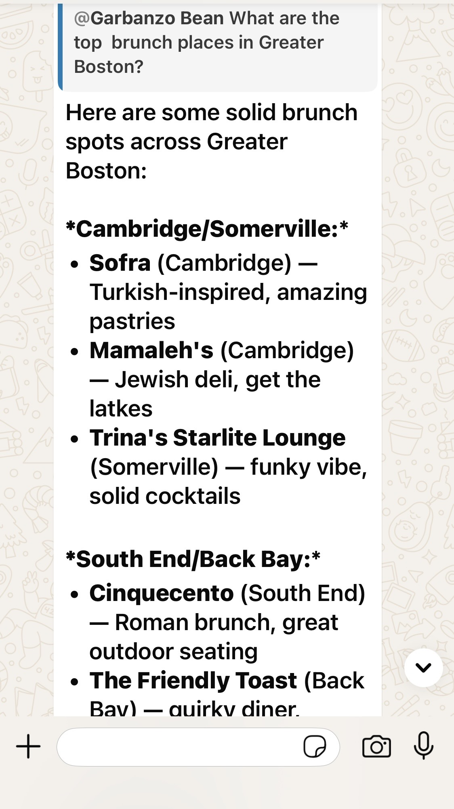
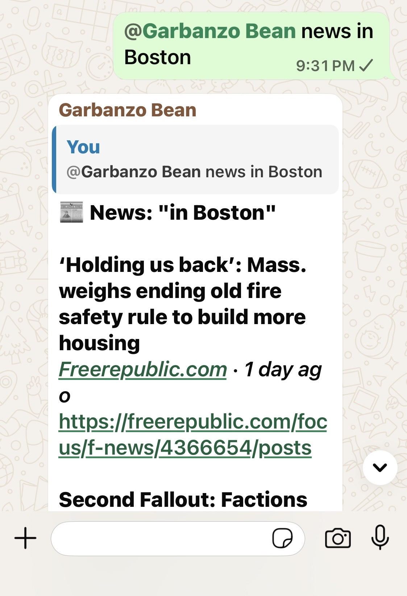
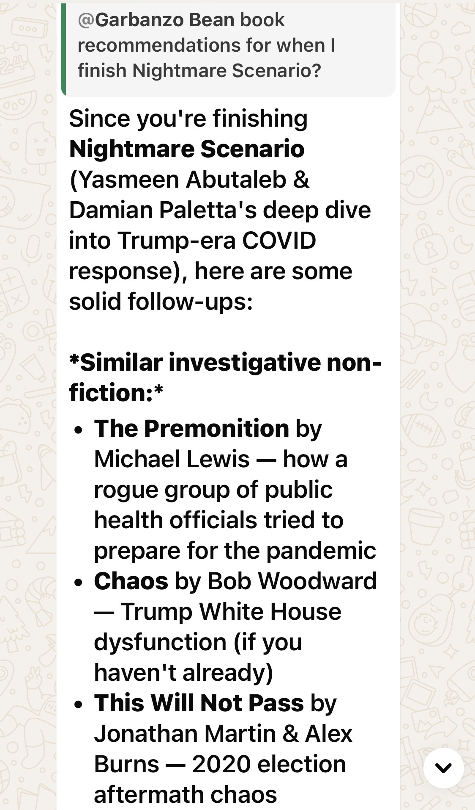
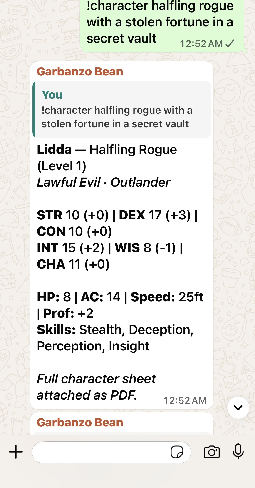
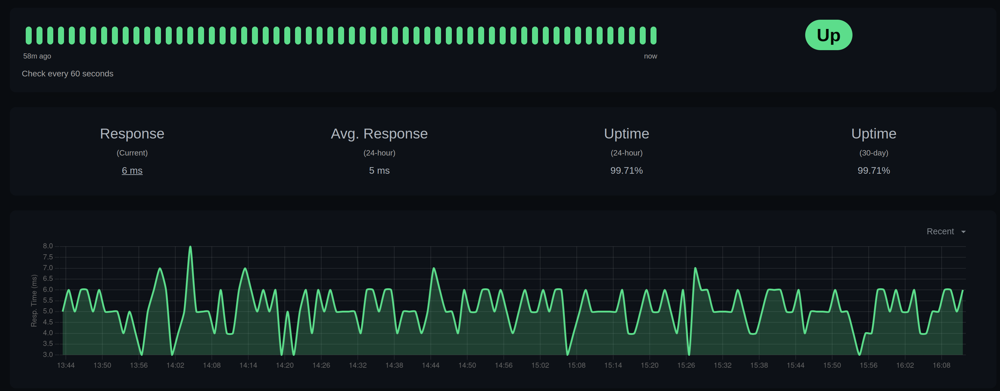

# Garbanzo


A WhatsApp community bot built with [Baileys](https://github.com/WhiskeySockets/Baileys) and cloud AI routing. Originally built for a 120+ member Boston-area meetup group, designed to be adaptable to any community or locale.

## Why Garbanzo

- Turn busy group chats into actionable community coordination (events, plans, recs, summaries)
- Keep group context useful with memory, profiles, moderation alerts, and daily owner digests
- Blend local + cloud AI routing so quality stays high while costs stay predictable
- Ship quickly with Docker Compose default deployment and setup wizard onboarding

## Who This Is For

- Meetup/community organizers running active group chats who want structure without killing vibe
- Hobby groups (book clubs, tabletop groups, local interest communities) needing quick planning tools
- Small teams that want an AI chat ops assistant with local-first data and low infra overhead
- Builders who need a reusable WhatsApp bot base with clear extension points and production guardrails

## What Makes Garbanzo Different

Garbanzo is opinionated around community operations, not just message transport.

- **Compared to API platforms (e.g. Twilio WhatsApp):** Twilio provides messaging primitives and sender onboarding APIs; Garbanzo ships community workflows out of the box (introductions, events enrichment, summaries, memory, owner digests, feedback triage). Source: [Twilio WhatsApp docs](https://www.twilio.com/docs/whatsapp).
- **Compared to WhatsApp client libraries (e.g. `whatsapp-web.js`, `@open-wa/wa-automate`):** those are foundational SDKs; Garbanzo is a production-ready app layer with routing, moderation, retries, health checks, setup wizard, and release workflows included. Sources: [whatsapp-web.js](https://github.com/pedroslopez/whatsapp-web.js), [open-wa](https://github.com/open-wa/wa-automate-nodejs).
- **AI cost/reliability posture:** configurable cloud provider ordering plus local Ollama routing for simple queries to reduce spend while preserving quality for complex prompts.
- **Ops-first defaults:** Docker Compose default deploy, branch protections/CI guardrails, credential rotation reminders, and owner-safe approval workflows (`!feedback issue <id>`).
- **Open and portable roadmap:** tagged Docker releases plus cross-platform native binary bundles as release assets.

## Personas

- Default persona: `docs/PERSONA.md`
- Optional per-platform persona override: `docs/personas/<platform>.md` (example: `docs/personas/whatsapp.md`)

## Lessons From Our OpenClaw-Inspired Stack (Trust & Maturity)

Before Garbanzo, we ran a more ambitious OpenClaw-inspired setup (many services, lots of automation, and a bigger "agent surface area"). That project taught a key lesson:

Reliability comes from fewer moving parts and explicit guardrails, not from more integrations.

Important clarification: this section is about our previous deployment and migration learnings, not a critique of the upstream OpenClaw project.

What we kept (inspiration from OpenClaw-style systems):

- A bias toward useful "skills" (weather/transit/events/summaries) rather than generic chat
- Tooling that makes the bot operationally observable (health endpoints, backups, logs)
- Cost discipline: explicit routing and fallbacks instead of "just use the biggest model"

What we intentionally changed in Garbanzo (why it's safer for group deployments):

- **Smaller surface area:** WhatsApp only today (no web control UI, no multi-channel gateway)
- **Curated features, not a marketplace:** no automatic install/run of third-party skills; features live in-repo and ship via release tags
- **Group safety defaults:** mention gating + per-group feature allowlists
- **Ops-first health semantics:** `GET /health` for visibility and `GET /health/ready` for alerting on disconnect/staleness
- **Local-first, inspectable state:** SQLite + explicit backups; health reports backup integrity
- **Security guardrails in CI:** secrets scan + typecheck + lint + tests (`npm run check`)

Upstream OpenClaw is explicitly designed as a general personal assistant with a large tool and channel surface, a skills ecosystem, and optional web surfaces. That power is great for single-user assistants, but it increases the amount you must secure.

OpenClaw itself warns its web interface is intended for local use and should not be exposed directly to the public internet:

- https://github.com/openclaw/openclaw/blob/main/SECURITY.md

For a more explicit comparison, see `docs/OPENCLAW_COMPARISON.md`.

## What It Does

Garbanzo connects to WhatsApp via the multi-device Web API, listens for @mentions in group chats, and responds with AI-powered answers, real-time data lookups, and community management tools. The default deployment is Docker Compose with persisted volumes for auth and SQLite data.

## Quick Start

```bash
# 1. Clone
git clone https://github.com/jjhickman/garbanzo-bot.git
cd garbanzo-bot

# 2. Run interactive setup (messaging platform, provider order, models, feature profile, optional PERSONA.md import, groups)
npm run setup

# 3. Start default deployment (Docker Compose)
docker compose up -d

# 4. Watch logs and scan QR code on first run
docker compose logs -f garbanzo

# 5. Health check
curl http://127.0.0.1:3001/health
```

## Local Development (without Docker)

```bash
npm install
cp .env.example .env
# Edit .env and config/groups.json
npm run dev

# Scan the QR code with WhatsApp when prompted
```

### Automated / Non-Interactive Setup

Use non-interactive mode for reproducible setup in scripts or CI-like environments:

```bash
npm run setup -- --non-interactive \
  --platform=whatsapp \
  --deploy=docker \
  --providers=openrouter,openai \
  --provider-order=openai,openrouter \
  --profile=events \
  --features=weather,transit,events,venues,poll,summary \
  --owner-jid=your_number@s.whatsapp.net \
  --owner-name="Your Name" \
  --group-id=120000000000000000@g.us \
  --group-name="General" \
  --persona-file=./my-persona.md
```

Get flag help:

```bash
npm run setup -- --help
```

Preview changes without writing files:

```bash
npm run setup -- --non-interactive --dry-run --platform=whatsapp --providers=openai --profile=lightweight
```

More recipes: [`docs/SETUP_EXAMPLES.md`](docs/SETUP_EXAMPLES.md)

On first run, Baileys will display a QR code in the terminal. Scan it with WhatsApp (Settings > Linked Devices) to authenticate. Auth state persists in `baileys_auth/` across restarts.

## Demo

A few real screenshots from Garbanzo in WhatsApp (real outputs, not mockups).

### Help + command discovery

In a busy group chat, "help" should be fast, readable, and copy/pasteable.

<p align="center">
  
</p>

### Introductions welcome

Introductions are the one place Garbanzo replies without needing an @mention.

<p align="center">
  
</p>

### Weather report

Quick, local weather for planning (default city is configurable).

<p align="center">
  
</p>

### MBTA alerts

Transit alerts + delays when the group is trying to meet up.

<p align="center">
  
</p>

### Restaurant recommendations

Local recommendations tuned to Boston-area neighborhoods.

<p align="center">
  
</p>

### Local news

Quick headlines and links when someone asks what's happening in the city.

<p align="center">
  
</p>

### Book recommendations

A lightweight example of "community concierge" behavior beyond Q&A.

<p align="center">
  
</p>

### D&D character sheet generator

Structured output + a real PDF attachment for tabletop groups.

<p align="center">
  
</p>

Setup flow (text-only for now):

```bash
npm run setup
# follow prompts to set platform, AI provider order/models, and groups

docker compose up -d
docker compose logs -f garbanzo
# scan QR code shown in terminal: WhatsApp > Settings > Linked Devices
```

Health check example:

```bash
curl http://127.0.0.1:3001/health
curl http://127.0.0.1:3001/health/ready
```

## Features

### AI Chat
- Responds to `@garbanzo` mentions with configurable cloud AI failover order (`AI_PROVIDER_ORDER`)
- Local Ollama fallback for simple queries (reduces API costs by routing to qwen3:8b)
- Conversation context from SQLite — remembers recent messages per group
- Multi-language detection (14 languages) — responds in the user's language
- Custom per-group persona — different tone per group (casual in General, structured in Events)
- Context compression — recent messages verbatim, older messages extractively compressed

### Community
- **Introductions** — AI-powered personal welcomes for new member introductions (no @mention needed)
- **Welcome messages** — greets new participants when they join a group
- **Events** — detects event proposals, enriches with weather/transit/AI logistics
- **Polls** — native WhatsApp polls: `!poll Question? / A / B / C`
- **Profiles** — opt-in interest tracking: `!profile interests hiking, cooking`
- **Recommendations** — `!recommend` suggests events based on your interests
- **Summaries** — `!summary` / `!catchup` for "what did I miss?" recaps
- **Feedback** — `!suggest`, `!bug`, `!upvote` for community-driven improvements
- **Daily digest** — owner-only summary of daily bot activity

### Information
- **Weather** — `!weather` / `!forecast` via Google Weather API (default: Boston)
- **MBTA Transit** — `!transit` / `!mbta` for real-time alerts, predictions, schedules
- **News** — `!news [topic]` via NewsAPI
- **Venues** — `!venue bars in somerville` via Google Places API
- **Books** — `!book [title]` via Open Library API

### D&D 5e
- **Dice** — `!roll 2d6+3`, `!roll d20`
- **Lookups** — `!dnd spell fireball`, `!dnd monster goblin`
- **Character sheets** — `!character elf wizard` generates a filled PDF (official WotC template, levels 1-20)

### Fun
- `!trivia` — random or category-specific trivia
- `!fact` — random fun fact
- `!today` — this day in history
- `!icebreaker` — conversation starters (40 curated, Boston-themed)

### Moderation & Safety
- Content moderation: regex patterns + OpenAI Moderation API (human-in-the-loop)
- Strike tracking with soft-mute after threshold
- Input sanitization: control chars, message length, prompt injection detection
- All flags sent to owner DM — bot never auto-acts on content

### Owner Commands (DM only)
- `!memory add/delete/search` — manage long-term community facts injected into AI context
- `!feedback` — review pending suggestions and bug reports
- `!feedback issue <id>` — create GitHub issue from accepted feedback item
- `!release <notes>` — broadcast release notes to all groups
- `!release changelog` — broadcast latest changelog section with version header
- `!strikes` — view moderation strike counts
- `!digest` — preview daily activity summary
- `!catchup intros` — recent introduction summaries

## Configuration

### Environment Variables

Copy `.env.example` to `.env` and configure:

| Variable | Required | Purpose |
|----------|----------|---------|
| `MESSAGING_PLATFORM` | No | Messaging app target (`whatsapp` default, `discord` planned) |
| `ANTHROPIC_API_KEY` or `OPENROUTER_API_KEY` or `OPENAI_API_KEY` | Yes | Cloud AI responses (Claude/OpenAI failover) |
| `AI_PROVIDER_ORDER` | No | Comma-separated cloud provider priority (e.g., `openai,openrouter,anthropic`) |
| `ANTHROPIC_MODEL` | No | Anthropic model override (default: `claude-sonnet-4-5-20250514`) |
| `OPENROUTER_MODEL` | No | OpenRouter model override (default: `anthropic/claude-sonnet-4-5`) |
| `OPENAI_MODEL` | No | OpenAI fallback model override (default: `gpt-4.1`) |
| `GOOGLE_API_KEY` | No | Weather + venue search |
| `MBTA_API_KEY` | No | Transit data (Boston-specific) |
| `NEWSAPI_KEY` | No | News search |
| `GITHUB_SPONSORS_URL` | No | Support link shown by owner `!support` command |
| `PATREON_URL` | No | Optional Patreon support link |
| `KOFI_URL` | No | Optional Ko-fi support link |
| `SUPPORT_CUSTOM_URL` | No | Optional custom support URL |
| `SUPPORT_MESSAGE` | No | Optional custom support intro message |
| `GITHUB_ISSUES_TOKEN` | No | Token used to create GitHub issues from owner-approved feedback |
| `GITHUB_ISSUES_REPO` | No | Target repo for issue creation (`owner/repo`) |
| `OLLAMA_BASE_URL` | No | Local model inference (default: `http://127.0.0.1:11434`) |
| `HEALTH_PORT` | No | Health endpoint port (default: `3001`) |
| `HEALTH_BIND_HOST` | No | Health bind host (`127.0.0.1` default, use `0.0.0.0` for external monitors) |
| `APP_VERSION` | No | Version marker used for Docker image labels + release note headers |
| `OWNER_JID` | Yes | Owner WhatsApp JID for admin features |
| `LOG_LEVEL` | No | `debug`, `info`, `warn`, `error` (default: `info`) |

Features degrade gracefully when API keys are missing — the bot won't crash, it just skips that feature.

### Group Configuration

Edit `config/groups.json` to map your WhatsApp group IDs:

```json
{
  "groups": {
    "YOUR_GROUP_JID@g.us": {
      "name": "General",
      "enabled": true,
      "requireMention": true,
      "persona": "Casual and conversational.",
      "enabledFeatures": ["weather", "transit", "fun"]
    }
  },
  "mentionPatterns": ["@yourbot", "@YourBot"],
  "admins": {
    "owner": {
      "name": "Your Name",
      "jid": "1YOURNUMBER@s.whatsapp.net"
    }
  }
}
```

To find your group JIDs, enable `LOG_LEVEL=debug` and check logs when messages arrive.

**Per-group options:**
- `enabled` — whether the bot responds in this group
- `requireMention` — if true, bot only responds to @mentions (recommended)
- `persona` — custom personality hint for this group (injected into Claude prompt)
- `enabledFeatures` — array of feature names to enable (omit for all features)

## Adapting for Your Community

Garbanzo was built for Boston, but the architecture is locale-agnostic. Here's what to customize:

### 1. Persona (`docs/PERSONA.md`)
This file defines the bot's personality and is loaded at runtime into every AI prompt. Replace Boston references with your city, update the voice/tone, and adjust the "community knowledge" section.

### 2. Transit (`src/features/transit.ts`)
Currently uses the MBTA API. To adapt:
- Replace the API client with your city's transit API
- Update station/route aliases in the lookup maps
- Adjust the response formatting

### 3. Weather (`src/features/weather.ts`)
Default location is Boston. Change the `DEFAULT_LOCATION` constant to your city.

### 4. Groups (`config/groups.json`)
Replace all group JIDs and names with your own. Persona hints are per-group.

### 5. Mention Patterns (`config/groups.json`)
Update `mentionPatterns` to match your bot's name as it appears in WhatsApp.

### 6. Icebreakers (`src/features/fun.ts`)
The curated icebreaker list is Boston-themed. Replace with your city's landmarks, neighborhoods, and culture.

### 7. Memory Facts (`!memory add`)
After deploying, use `!memory add` to teach the bot about your community's venues, traditions, and members.

## Architecture

```
src/
  index.ts              # Entry point — starts bot, wires services
  bot/
    connection.ts       # Baileys socket, auth, reconnect, staleness detection
    handlers.ts         # Top-level message dispatcher
    group-handler.ts    # Group message routing + mention handling
    owner-commands.ts   # Owner DM command routing
    response-router.ts  # Bang commands + natural language feature routing
    reactions.ts        # Emoji reactions (🫘 for acknowledgments)
    groups.ts           # Group config, feature flags, per-group persona
  ai/
    router.ts           # Model selection (cloud vs Ollama) + cost tracking
    claude.ts           # Claude-family caller (OpenRouter/Anthropic) + circuit breaker
    chatgpt.ts          # OpenAI fallback caller + circuit breaker
    cloud-providers.ts  # Shared cloud request builders/parsers
    ollama.ts           # Local Ollama client + warm-up scheduler
    persona.ts          # System prompt builder (PERSONA.md + memory + language)
  features/             # One file per feature, max ~300 lines
    character/          # D&D 5e character sheet generator (6 files)
    weather.ts          # Google Weather API
    transit.ts          # MBTA schedule/alerts
    transit-data.ts     # Station/route aliases, emoji maps, types
    moderation.ts       # Content moderation (human-in-the-loop)
    moderation-patterns.ts # Regex rules, category maps, thresholds
    introductions.ts    # Auto-respond to new member intros
    intro-classifier.ts # Signal-based intro detection logic
    dnd.ts              # D&D dice roller + command handler
    dnd-lookups.ts      # SRD API lookups (spell, monster, class, item)
    events.ts, news.ts, books.ts, venues.ts, polls.ts, fun.ts,
    welcome.ts, feedback.ts, profiles.ts, summary.ts,
    recommendations.ts, language.ts, memory.ts, media.ts,
    voice.ts, links.ts, release.ts, help.ts, router.ts, digest.ts
  middleware/
    rate-limit.ts       # Per-user/per-group sliding window
    logger.ts           # Pino structured logging
    context.ts          # Two-tier context compression + caching
    stats.ts            # Token estimation, daily cost tracking
    health.ts           # HTTP health endpoint + memory watchdog
    retry.ts            # Dead letter retry queue
    sanitize.ts         # Input sanitization + prompt injection detection
  utils/
    config.ts           # Zod-validated env vars
    formatting.ts       # WhatsApp text formatting
    jid.ts              # JID parsing/comparison
    db.ts               # SQLite barrel (re-exports schema, profiles, maintenance)
    db-schema.ts        # Database init, table definitions
    db-profiles.ts      # Member profile queries
    db-maintenance.ts   # Backup, vacuum, prune, scheduled maintenance
config/groups.json      # Per-group settings
docs/                   # Persona, roadmap, security, infrastructure
tests/                  # Vitest (12 files, 446 tests)
```

## Stack

- **Runtime:** Node.js 20+ / TypeScript (ES Modules, strict mode)
- **WhatsApp:** @whiskeysockets/baileys v6 (multi-device)
- **AI:** Ollama qwen3:8b (simple local queries) + configurable cloud failover chain (`AI_PROVIDER_ORDER`)
- **Storage:** SQLite via better-sqlite3 (WAL mode, auto-vacuum, nightly backups)
- **Validation:** Zod
- **Logging:** Pino (structured JSON)
- **Testing:** Vitest (446 tests)
- **PDF:** pdf-lib (D&D character sheets)

## Development

```bash
npm run dev         # Hot-reload (tsx watch)
npm run typecheck   # Type-check only
npm run test        # Run all tests
npm run lint        # ESLint
npm run check       # Full pre-commit: secrets + typecheck + lint + test
npm run release:plan # Dry-run release validation before tagging
# add -- --clean-artifacts to remove local release/archive folders
npm run build       # Compile to dist/
npm run start       # Production (from dist/)
```

## Production Deployment

Default: Docker Compose.

```bash
# Start
docker compose up -d

# Logs
docker compose logs -f garbanzo

# Check status
curl http://127.0.0.1:3001/health
```

By default, `docker compose up -d` runs the published `latest` image.

To deploy a specific release image:

```bash
APP_VERSION=0.1.1 docker compose pull garbanzo
APP_VERSION=0.1.1 docker compose up -d
```

Recommended (production) — pin a version and force pulls (prevents accidentally running a stale cached image):

```bash
APP_VERSION=0.1.1 docker compose -f docker-compose.yml -f docker-compose.prod.yml pull garbanzo
APP_VERSION=0.1.1 docker compose -f docker-compose.yml -f docker-compose.prod.yml up -d
```

Local development (build from source):

```bash
docker compose -f docker-compose.yml -f docker-compose.dev.yml up -d --build
```

Cross-platform portable binaries are published on version tags (`v*`) as release assets:

- `garbanzo-linux-x64.tar.gz`
- `garbanzo-linux-arm64.tar.gz`
- `garbanzo-macos-arm64.tar.gz`
- `garbanzo-windows-x64.zip`

Alternative: systemd user service for native Node deployment (`scripts/garbanzo.service`).

If you previously used `garbanzo-bot.service`, migrate to `garbanzo.service`.

The health endpoint returns JSON with connection status, uptime, memory usage, message staleness, and backup integrity status.

### Monitoring with Uptime Kuma

This is what Garbanzo looks like on a basic Kuma HTTP monitor (tracking `/health`):

<p align="center">
  
</p>

If your Kuma dashboard is running on another host (for example `nas.local`), expose health on a reachable bind host:

```bash
HEALTH_BIND_HOST=0.0.0.0
HEALTH_PORT=3001
```

Then configure an HTTP monitor in Kuma to check:

```text
http://<garbanzo-host>:3001/health
```

Optional Prometheus scrape (if you enable it):

```text
http://<garbanzo-host>:3001/metrics
```

Optional (recommended) second monitor — alert when WhatsApp is disconnected or "connected but deaf":

```text
http://<garbanzo-host>:3001/health/ready
```

`/health/ready` returns:

- `200` when connected and not stale
- `503` when disconnected/connecting or stale

Recommended Kuma monitor settings:

- **Monitor type:** HTTP(s)
- **Method:** GET
- **Heartbeat interval:** 30s
- **Request timeout:** 5s
- **Retries:** 3
- **Accepted status codes:** 200-299
- **Resend interval:** 30m (or your preferred alert noise level)

Suggested setup on `nas.local`:

1. Add monitor name `garbanzo-health` with URL `http://<garbanzo-host>:3001/health`.
2. Save, then verify response body includes `status`, `stale`, `uptime`, and `backup` keys.
3. Add your notification channel (Discord, email, Slack, etc.) and run a test notification.
4. Optional second monitor: keyword check on `"stale":false` if you want alerting on stale chat activity, not just process uptime.

Keep network access restricted to trusted LAN/VPN segments.

If you expose port `3001` on your LAN for external monitoring, restrict it to your monitor host. For Docker deployments, the most reliable place is the `DOCKER-USER` iptables chain (so Docker's own rules can't bypass it):

```bash
# Allow Uptime Kuma (NAS) to reach /health
sudo iptables -I DOCKER-USER 1 -i <lan-iface> -p tcp -s 192.168.50.219 --dport 3001 -j ACCEPT

# Drop everyone else on LAN -> 3001
sudo iptables -I DOCKER-USER 2 -i <lan-iface> -p tcp --dport 3001 -j DROP
```

To persist across reboots on Ubuntu, install and save:

```bash
sudo apt-get install -y iptables-persistent
sudo netfilter-persistent save
```

## Support Garbanzo

[](https://github.com/sponsors/jjhickman)

If Garbanzo is useful for your community, you can support development and operating costs.

Note: Donations (Sponsors/Patreon/Ko-fi) help fund development but do not grant a commercial license. For commercial licensing, see `COMMERCIAL_LICENSE.md`.

- GitHub Sponsors: https://github.com/sponsors/jjhickman
- (Optional) Configure Patreon/Ko-fi/custom links in `.env`

Owner-side support messaging:

- `!support` — preview the support message in owner DM
- `!support broadcast` — send support message to all enabled groups

Support links are read from:

- `GITHUB_SPONSORS_URL`
- `PATREON_URL`
- `KOFI_URL`
- `SUPPORT_CUSTOM_URL`
- `SUPPORT_MESSAGE` (optional custom intro text)

Feedback-to-issue automation (owner approved):

- `!feedback issue <id>` creates a GitHub issue for an accepted item
- Requires `GITHUB_ISSUES_TOKEN` and optional `GITHUB_ISSUES_REPO`

## Main Branch Stability

Repo guardrails are configured under `.github/`:

- `ci.yml` runs `npm run check` on PRs and pushes to `main`
- `automation-guard.yml` blocks non-Dependabot PRs when open Dependabot PRs exist (unless `allow-open-dependabot` label is used)
- `CODEOWNERS` requires owner review coverage
- `pull_request_template.md` enforces verification checklist discipline
- `dependabot.yml` keeps npm/docker dependencies updated weekly
- `credential-rotation-reminder.yml` opens a monthly credential rotation checklist issue
- `release-docker.yml` builds and publishes versioned Docker images to GHCR (and optional Docker Hub) on `v*` tags
- `release-native-binaries.yml` builds and attaches cross-platform native bundles on `v*` tags
- release Docker workflow runs a smoke test against published image health endpoint
- `FUNDING.yml` enables sponsorship links in GitHub UI

## GitHub Account Workflow

For stable review discipline, use two accounts:

- `garbanzo-dev` for authoring PRs
- `jjhickman` for reviewing/approving/merging

Helper commands:

```bash
npm run gh:status
npm run gh:ensure
npm run gh:switch:author
npm run gh:switch:owner
npm run gh:whoami
```

These wrappers call `scripts/gh-workflow.sh`.

## Credential Rotation Workflow

- Monthly reminder issue is automated via `.github/workflows/credential-rotation-reminder.yml`.
- To update GitHub Actions secrets from your local shell environment:

```bash
# Example (values supplied from your shell/session manager)
OPENAI_API_KEY=... OPENROUTER_API_KEY=... ANTHROPIC_API_KEY=... npm run rotate:gh-secrets
```

Use `bash scripts/rotate-gh-secrets.sh --help` for full options.

## Docs

- [PERSONA.md](docs/PERSONA.md) — Bot personality and voice guidelines
- [ROADMAP.md](docs/ROADMAP.md) — Phased implementation plan (Phases 1-6 complete, Phase 7 in progress)
- [SECURITY.md](docs/SECURITY.md) — Infrastructure security audit + data privacy
- [INFRASTRUCTURE.md](docs/INFRASTRUCTURE.md) — Hardware and network reference
- [ARCHITECTURE.md](docs/ARCHITECTURE.md) — Message flow, AI routing, and multimedia pipeline
- [SETUP_EXAMPLES.md](docs/SETUP_EXAMPLES.md) — Interactive and non-interactive setup recipes
- [RELEASES.md](docs/RELEASES.md) — Versioning, tag flow, and Docker image release process
- [AWS.md](docs/AWS.md) — Running Garbanzo on AWS (including CDK EC2 bootstrap)
- [SCALING.md](docs/SCALING.md) — Scaling constraints (Baileys + SQLite) and future path
- [AWS_MCP.md](docs/AWS_MCP.md) — AWS MCP notes (development/ops tool, not required)
- [OPENCLAW_COMPARISON.md](docs/OPENCLAW_COMPARISON.md) — OpenClaw-style stack comparison and tradeoffs
- [MULTI_PLATFORM.md](docs/MULTI_PLATFORM.md) — Multi-platform roadmap (personas per platform)
- [CHANGELOG.md](CHANGELOG.md) — Full release history
- [CONTRIBUTING.md](CONTRIBUTING.md) — How to contribute
- [AGENTS.md](AGENTS.md) — Coding agent instructions and conventions

## License

Garbanzo is source-available under the [Prosperity Public License 3.0.0](LICENSE):

- Free for noncommercial use (personal + qualifying noncommercial organizations)
- Commercial use is allowed for a limited 30-day trial
- Ongoing commercial use requires a commercial license (see `COMMERCIAL_LICENSE.md`)

See `LICENSE_FAQ.md` for examples.
