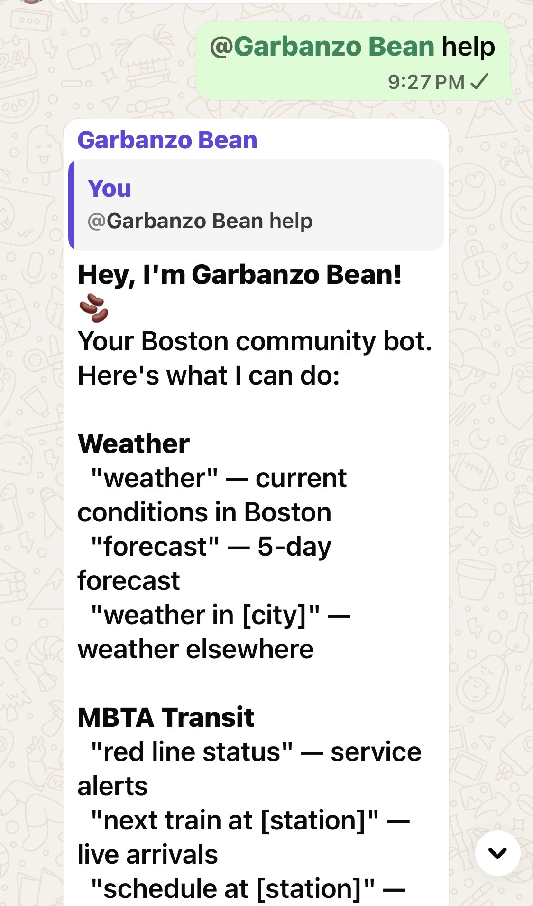
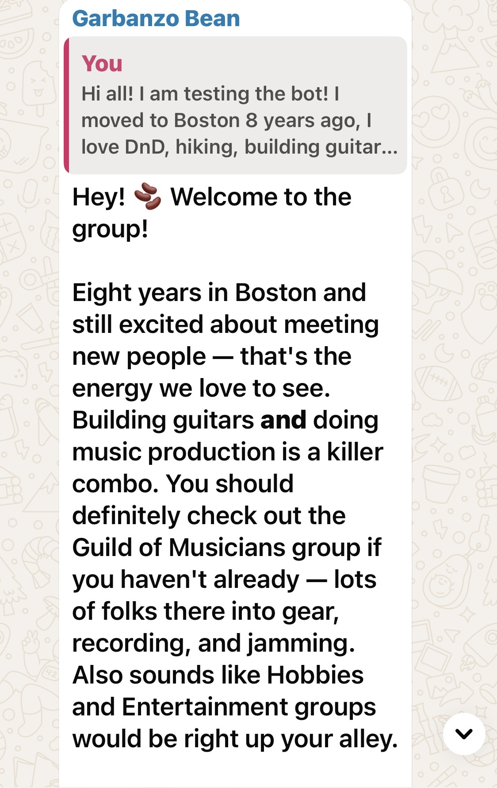
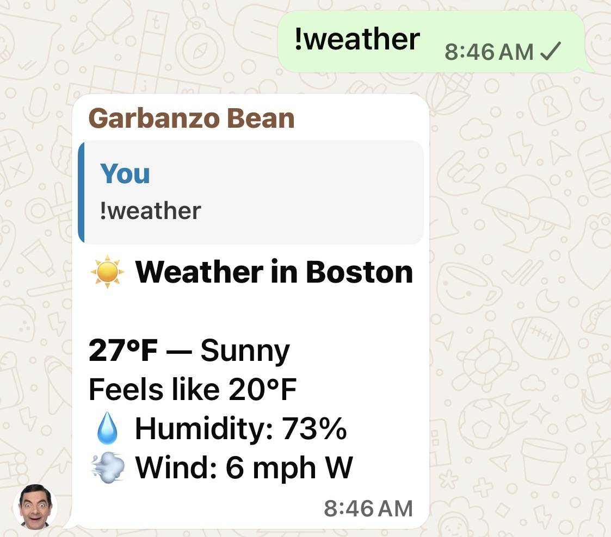
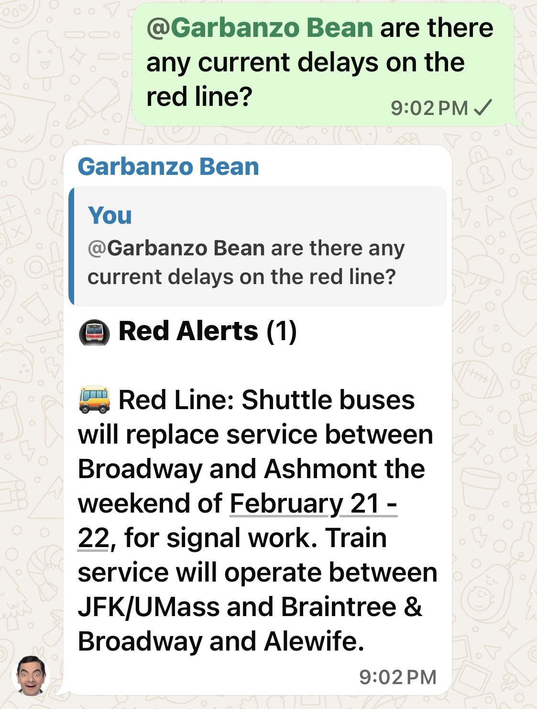
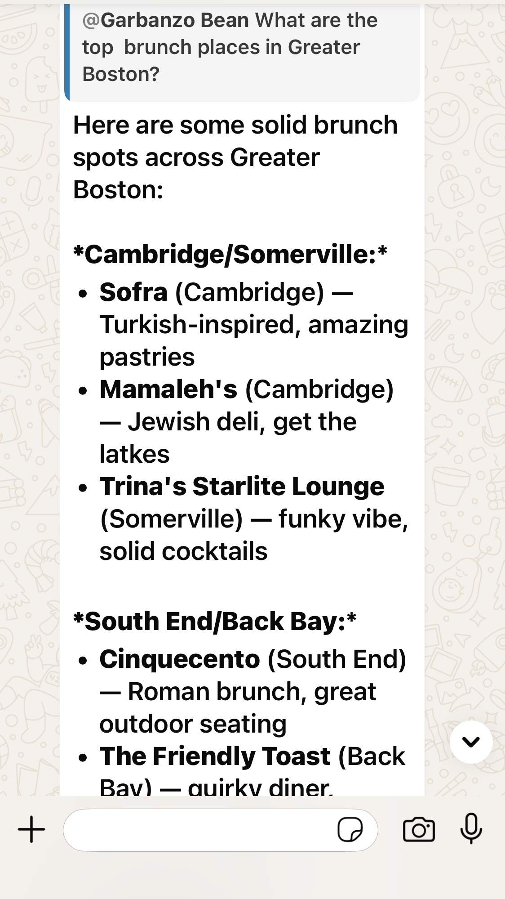
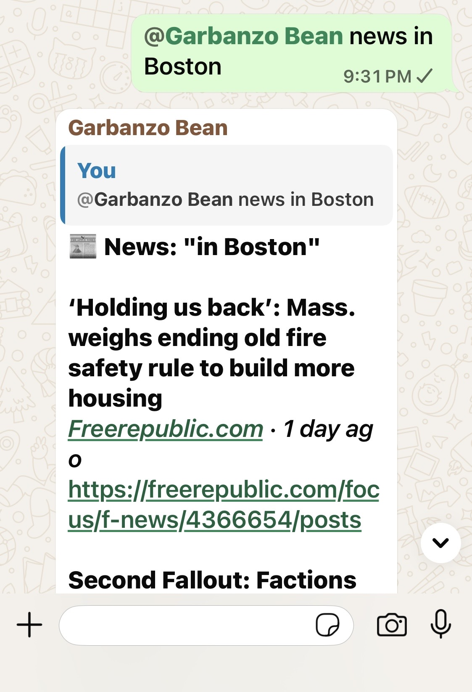
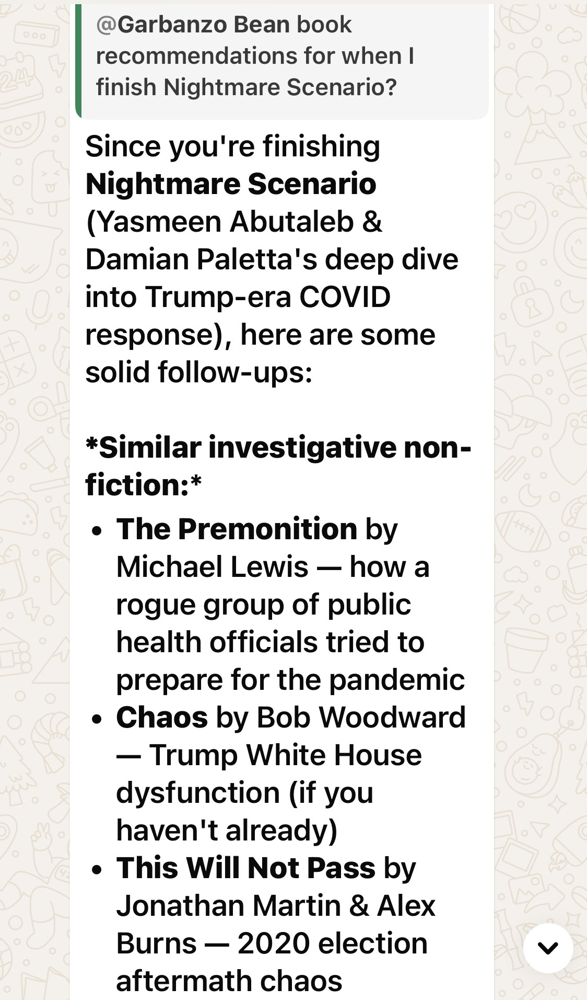
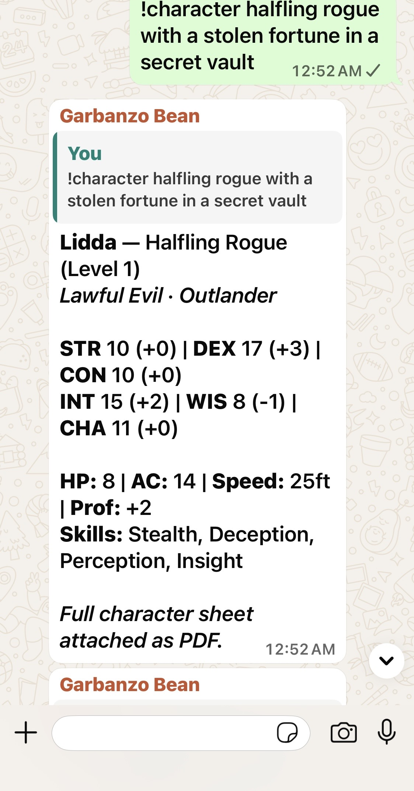
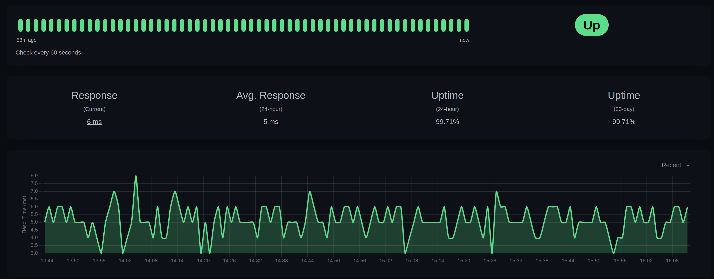

# Garbanzo
> Website: https://garbanzobot.com  |  Docker Hub: https://hub.docker.com/r/jjhickman/garbanzo


[](https://github.com/jjhickman/garbanzo-bot/actions/workflows/ci.yml)
[](https://hub.docker.com/r/jjhickman/garbanzo)
[](https://hub.docker.com/r/jjhickman/garbanzo)
[](LICENSE)

Garbanzo is an AI chat operations platform for communities and small teams. It combines multi-provider LLM routing, practical automations, and Docker-first deployment so you can run useful AI workflows directly in group chat.

**Website:** [garbanzobot.com](https://garbanzobot.com)
<p align="center">
  <a href="https://garbanzobot.com"></a>
</p>

## Highlights
- Multi-provider LLM routing (OpenAI GPT-5 via the Responses API, Claude, Gemini, Bedrock, OpenRouter) with failover, native tool calling, and optional local Ollama for low-cost/simple traffic.
- Community workflows for introductions, summaries, events + reminders, polls, recommendations, feedback, curated **and automatic** community memory, weekly recaps, and owner digests.
- Practical integrations for weather, MBTA transit, news, venues, books, D&D dice/lookups, and character sheet PDFs — callable by name or invoked naturally by the model when tool calling is on.
- Discord runtime (discord.js Gateway) with opt-in channels, WhatsApp runtime (Baileys v7) with browser login and anti-ban outbound safety, and Slack support with demo mode.
- Band mode (`BAND_FEATURES_ENABLED`): the same image also runs as Remy, a Discord assistant for bands, with a song catalog, rehearsal scheduling and reminders, availability tracking, setlists, and song idea capture with audio transcription.
- Operational guardrails: health/readiness endpoints, verified off-machine backups, anti-ban outbound safety, retry queue, moderation review (edit-aware), rate limits, and per-group feature allowlists.
- Observability built in: token-gated `/admin` usage & cost page, Prometheus metrics, and a pre-provisioned Grafana dashboard enabled with the `monitoring` compose profile.
- Docker-first deployment with SQLite by default, optional Postgres, and a self-hosted Qdrant vector store for semantic recall.
- Cross-platform bridging: relay chat between Discord and WhatsApp instances and share curated community memory across them, off by default — see [docs/BRIDGING.md](docs/BRIDGING.md).

## See it in action
A few real screenshots from Garbanzo in WhatsApp (real outputs, not mockups).

### Help + command discovery
In a busy group chat, "help" should be fast, readable, and copy/pasteable.
<p align="center">
  
</p>

### Introductions welcome
Introductions are the one place Garbanzo replies without needing an @mention.
<p align="center">
  
</p>

### Weather report
Quick, local weather for planning (default city is configurable).
<p align="center">
  
</p>

### MBTA alerts
Transit alerts + delays when the group is trying to meet up.
<p align="center">
  
</p>

### Restaurant recommendations
Local recommendations tuned to Boston-area neighborhoods.
<p align="center">
  
</p>

### Local news
Quick headlines and links when someone asks what's happening in the city.
<p align="center">
  
</p>

### Book recommendations
A lightweight example of "community concierge" behavior beyond Q&A.
<p align="center">
  
</p>

### D&D character sheet generator
Structured output + a real PDF attachment for tabletop groups.
<p align="center">
  
</p>

## Quick Start
Requirements: Docker + Docker Compose for the default deployment; Node.js 20+ only for the setup wizard and local development.

```bash
# 1. Clone
git clone https://github.com/jjhickman/garbanzo-bot.git
cd garbanzo-bot

# 2. Create shared env and choose profiles
cp .env.example .env
# In .env: set COMPOSE_PROFILES=discord, add one AI provider key, and set MONITORING_TOKEN if using monitoring.

# 3. Create a platform env file. Discord is the default profile.
cp .env.discord.example .env.discord
# Fill in DISCORD_BOT_TOKEN, DISCORD_OWNER_ID, and channel config.
cp config/discord-channels.example.json config/discord-channels.json

# Optional WhatsApp instance:
# cp .env.whatsapp.example .env.whatsapp
# In .env: set COMPOSE_PROFILES=discord,whatsapp
# Fill in OWNER_JID and WhatsApp settings.

# 4. Start the selected profile set
docker compose up -d

# Optional: pull official Docker Hub image directly or pin the compose image
# docker pull jjhickman/garbanzo:2.0.0
# APP_VERSION=2.0.0 docker compose pull
# APP_VERSION=2.0.0 docker compose up -d

# 5. Watch logs
docker compose logs -f discord
# For WhatsApp: docker compose logs -f whatsapp

# 6. Health check
curl http://127.0.0.1:3002/health
# For WhatsApp: curl http://127.0.0.1:3001/health

# 7. First AI response test (in chat)
# @garbanzo !summary
# @garbanzo plan dinner in somerville this friday

# Optional: monitoring stack (Prometheus + Grafana dashboard)
# In .env: set COMPOSE_PROFILES=discord,monitoring, METRICS_ENABLED=true, and MONITORING_TOKEN.
docker compose up -d
# Grafana: http://<host>:3000 (login: admin / your MONITORING_TOKEN)
```

For a guided setup, run `npm run setup`. The wizard leads with Discord and writes `.env` plus the env file for the platform you pick.

## Table of Contents
[Features](#features) · [Configuration](#configuration) · [Platforms & Login](#platforms--login) · [AI Providers & Routing](#ai-providers--routing) · [Deployment](#deployment) · [Monitoring & Observability](#monitoring--observability) · [Customizing for Your Community](#customizing-for-your-community) · [Architecture & Stack](#architecture--stack) · [Development](#development) · [Docs](#docs) · [Contributing - Support - License](#contributing---support---license)

## Features
### AI Chat Capabilities
- Responds to `@garbanzo` mentions with configurable cloud AI failover order (`AI_PROVIDER_ORDER`)
- **Native tool calling** (`AI_TOOL_CALLING`) — the model invokes weather/transit/venues/news/books/memory tools mid-reply, so members ask naturally instead of using commands
- **Automatic community memory** (`MEMORY_AUTO_EXTRACT`) — durable facts are extracted asynchronously from conversation, deduped, capped, and curated with `!memory`
- Local Ollama fallback for simple queries (model via `OLLAMA_MODEL`; runs 1-3B models on a Pi 5 — see docs/INFRASTRUCTURE.md)
- Conversation context from SQLite or Postgres — remembers recent messages per group
- **Session memory** — conversations are sessionized by inactivity gap, extractively summarized, and stored with vector embeddings for long-horizon recall (e.g., "what did we decide about trivia last week?")
- **Semantic retrieval** — session summaries and message hits are merged and reranked with a unified scoring model (recency decay, token overlap, coverage deduplication) before injection into the AI prompt
- **Vector memory (Qdrant)** — session summaries and community facts are embedded with OpenAI `text-embedding-3-small` into a self-hosted Qdrant store; keyword search takes over automatically when Qdrant is unavailable, and `VECTOR_STORE=none` keeps keyword-only
- Multi-language detection (14 languages) — responds in the user's language
- Custom per-group persona — different tone per group (casual in General, structured in Events)
- Context compression — recent messages verbatim, older messages extractively compressed, session summaries for long-range context
### Community Workflows
- **Introductions** — AI-powered personal welcomes for new member introductions (no @mention needed)
- **Welcome messages** — greets new participants when they join a group
- **Events** — detects event proposals, enriches with weather/transit/AI logistics, and posts a reminder before start time (`!events` to manage)
- **Weekly recap** — `!recap` and a scheduled Sunday owner DM: 7-day totals, most active groups, unique participants
- **Polls** — native WhatsApp polls: `!poll Question? / A / B / C`
- **Profiles** — opt-in interest tracking: `!profile interests hiking, cooking`
- **Recommendations** — `!recommend` suggests events based on your interests
- **Summaries** — `!summary` / `!catchup` for "what did I miss?" recaps
- **Feedback** — `!suggest`, `!bug`, `!upvote` for community-driven improvements
- **Daily digest** — owner-only summary of daily bot activity
### External Integrations
- **Weather** — `!weather` / `!forecast` via Google Weather API (default: Boston)
- **MBTA Transit** — `!transit` / `!mbta` for real-time alerts, predictions, schedules
- **News** — `!news [topic]` via NewsAPI
- **Venues** — `!venue bars in somerville` via Google Places API
- **Books** — `!book [title]` via Open Library API
### D&D 5e
- **Dice** — `!roll 2d6+3`, `!roll d20`
- **Lookups** — `!dnd spell fireball`, `!dnd monster goblin`
- **Character sheets** — `!character elf wizard` generates a filled PDF (official WotC template, levels 1-20)
### Fun
- `!trivia` — random or category-specific trivia
- `!fact` — random fun fact
- `!today` — this day in history
- `!icebreaker` — conversation starters (40 curated, Boston-themed)
### Band Mode (Remy)
Run the same bot as a band assistant on Discord. Everything below stays off unless `BAND_FEATURES_ENABLED=true`, so community deployments are unaffected.
- **Song catalog** — `!song add/list/show/set/delete` with key, tempo, and status (idea, rough, tight, gig-ready)
- **Rehearsals** — `!rehearsal schedule/list/show/cancel/note`, with a Discord reminder before each one
- **Availability** — `!available <id> yes|no|maybe`, read back in `!rehearsal show`
- **Setlists** — `!setlist create/add/remove/move/show`, ordered lists built from the song catalog
- **Practice agenda** — `!agenda` shows the next rehearsal, songs needing work, and the current setlist
- **Song ideas** — `!idea capture` from text or a dropped audio clip (transcribed via a Whisper server at `WHISPER_URL`); `!idea promote` turns an idea into a catalog song
- **Sections and lyrics** — `!section` and `!lyrics` organize each song's structure, words, and chords

Deploy band mode on the Discord profile with `.env.discord`, `BAND_FEATURES_ENABLED=true`, and `config/discord-channels.json`: [docs/REMY_DEPLOY.md](docs/REMY_DEPLOY.md)
### Cross-platform bridging
Off by default (`BRIDGE_ENABLED`, `SHARED_MEMORY_ENABLED`). Two independent tiers:
- **Shared memory** — `!memory share <id>` / `!memory unshare <id>` explicitly copies a curated fact into a shared collection that other instances can read, namespaced by instance id so nothing collides and nothing is shared automatically.
- **Message bridging** — `config/bridge-map.json` maps channels/groups across instances; relayed messages carry attribution (`Ana (Discord): ...`), and WhatsApp-bound relays default to a periodic digest so they never bypass the anti-ban outbound-safety layer.

Works over plain HTTP for two instances, or a RabbitMQ broker profile for three or more. Full setup: [docs/BRIDGING.md](docs/BRIDGING.md)
### Moderation & Safety
- Content moderation: regex patterns + OpenAI Moderation API (human-in-the-loop)
- Strike tracking with soft-mute after threshold
- Input sanitization: control chars, message length, prompt injection detection
- All flags sent to owner DM — bot never auto-acts on content
### Owner Commands (DM only)
- `!memory add/delete/search` — manage long-term community facts injected into AI context
- `!feedback` — review pending suggestions and bug reports
- `!release rules` — show member-facing release update rules
- `!release preview <notes>` — lint + preview release notes without sending
- `!release send <notes>` — broadcast release notes to all enabled groups
- `!release send <group> <notes>` — broadcast release notes to one group
- `!release send changelog [lines]` — broadcast latest changelog snippet
- `!release internal <notes>` — keep update operator-only (no broadcast)
- `!strikes` — view moderation strike counts
- `!digest` — preview daily activity summary
- `!recap` — weekly community recap (also DM'd every Sunday evening)
- `!events` / `!events cancel <id>` — manage upcoming event reminders
- `!whatsapp status|pause|resume|held|release|discard` — anti-ban outbound safety controls
- `!support [broadcast]` — share support links (optionally to all groups)
- `!catchup intros` — recent introduction summaries

## Configuration
Copy `.env.example` to `.env`, then set shared provider, monitoring, vector, and integration values. Copy `.env.discord.example` to `.env.discord` for Discord or `.env.whatsapp.example` to `.env.whatsapp` for WhatsApp. Group names, per-group personas, mention patterns, and feature allowlists live in platform config files under `config/`.
Features degrade gracefully when API keys are missing — the bot won't crash, it just skips that feature.
Full reference: [docs/CONFIGURATION.md](docs/CONFIGURATION.md)

<a id="platforms--login"></a>

## Platforms & Login
Discord is the default runtime and uses the official Gateway API. The bot reads and replies in opt-in channels, welcomes new members, and posts scheduled digests, recaps, and reminders (channel and role config lives in `config/discord-channels.json`). WhatsApp is fully supported through Baileys, an unofficial WhatsApp Web API, which carries account risk; keep the anti-ban safety layer enabled. Slack has support plus a local demo mode for pipeline verification without a full app setup.
Setup details: [docs/PLATFORMS.md](docs/PLATFORMS.md)

<a id="ai-providers--routing"></a>

## AI Providers & Routing
- **Multi-provider cloud failover:** route across Claude, OpenAI, Gemini, Bedrock, and OpenRouter with configurable priority (`AI_PROVIDER_ORDER`)
- **Hybrid cloud + local mode:** use Ollama for low-cost/simple requests while reserving cloud models for high-complexity prompts
- **Per-provider model control:** set explicit model overrides (`ANTHROPIC_MODEL`, `OPENAI_MODEL`, `GEMINI_MODEL`, `OPENROUTER_MODEL`, `BEDROCK_MODEL_ID`)
- **Cost-aware operations:** token and pricing fields support practical cost tracking and routing decisions

| Provider | Primary Strength | Typical Role in Routing |
|----------|------------------|-------------------------|
| Anthropic Claude | nuanced reasoning, long-form quality | quality fallback or alternate primary |
| OpenAI | GPT-5 family via the Responses API, strong tool calling | default primary (`openai,anthropic`) |
| Gemini | speed and cost efficiency | fast primary for high-volume traffic |
| OpenRouter | model marketplace flexibility | portability/fallback layer |
| AWS Bedrock | managed AWS inference + IAM-native auth | cloud provider in failover order |
| Ollama (local) | privacy + near-zero marginal cost | simple-query local path |
OpenAI supports `OPENAI_AUTH_MODE=apikey` by default. Experimental `OPENAI_AUTH_MODE=oauth` can sign in with ChatGPT and store tokens in `data/openai-oauth.json`.
> Warning: OAuth mode is unofficial and against OpenAI's ToS — it uses a private ChatGPT backend (SSE) and can break without notice. Verified working 2026-07-02, but never make it your only provider.
Headless/manual auth and Docker token injection: [docs/CONFIGURATION.md#openai-oauth-experimental](docs/CONFIGURATION.md#openai-oauth-experimental)

## Deployment
Default Docker Compose deployment:

```bash
docker compose up -d
docker compose logs -f discord
curl http://127.0.0.1:3002/health
```

Pinned production pull:

```bash
APP_VERSION=2.0.0 docker compose -f docker-compose.yml -f docker-compose.prod.yml pull
APP_VERSION=2.0.0 docker compose -f docker-compose.yml -f docker-compose.prod.yml up -d
```

Local development build:

```bash
docker compose -f docker-compose.yml -f docker-compose.dev.yml up -d --build
```

Cross-platform portable binaries are published on version tags (`v*`) as release assets. Alternative: systemd user service for native Node deployment (`scripts/garbanzo.service`).
### Monitoring & Observability

Three built-in layers, all optional (guide: [docs/MONITORING.md](docs/MONITORING.md)):

1. **`/admin` page** — token-gated usage & cost snapshot (daily AI spend, provider mix, per-group activity, anti-ban counters) served from the health port. Zero setup.
2. **Prometheus + Grafana** — a full stack that runs beside selected bot profiles on the same host (`COMPOSE_PROFILES=discord,monitoring` or `discord,whatsapp,monitoring`), with a pre-provisioned **Community Ops** dashboard: messages and replies by group, AI cost by provider, tool usage, anti-ban trends, and backup integrity, over 30 days of history.

<p align="center">
  
</p>

3. **Uptime Kuma** (or any HTTP monitor) — `/health/ready` returns non-200 the moment WhatsApp disconnects, ideal for push alerting:

<p align="center">
  
</p>

The `/health` endpoint reports connection status, uptime, memory, message staleness, and backup integrity as JSON. Deep Kuma settings and LAN firewall examples: [docs/INFRASTRUCTURE.md#monitoring--lan-firewall](docs/INFRASTRUCTURE.md#monitoring--lan-firewall)

### Backups

Nightly off-machine backups of the WhatsApp credentials + database (systemd timer, verification, retention, one-command restore): [docs/BACKUPS.md](docs/BACKUPS.md)

## Customizing for Your Community
Garbanzo was built for Boston, but the architecture is locale-agnostic. Customize the persona, transit provider, weather defaults, groups, mention patterns, icebreakers, and memory facts.
Guide: [docs/CUSTOMIZATION.md](docs/CUSTOMIZATION.md)

<a id="architecture--stack"></a>

## Architecture & Stack
Garbanzo separates a platform-agnostic core pipeline from runtime adapters under `src/platforms/*`. It runs on Node.js 20+ and TypeScript ES Modules with Zod validation, Pino structured logging, Vitest tests, and SQLite by default. Postgres is available for larger deployments, and a self-hosted Qdrant store handles vector memory and semantic retrieval.
Full walkthrough: [docs/ARCHITECTURE.md](docs/ARCHITECTURE.md)

## Development

```bash
npm run dev          # Hot-reload (tsx watch)
npm run setup        # Interactive setup wizard
npm run typecheck    # Type-check only
npm run lint         # ESLint
npm run test         # Run all tests
npm run check        # Full pre-commit: secrets + typecheck + lint + test
npm run build        # Compile to dist/
npm run start        # Production (from dist/)
```

## Docs
Getting started: [CONFIGURATION.md](docs/CONFIGURATION.md), [PLATFORMS.md](docs/PLATFORMS.md), [CUSTOMIZATION.md](docs/CUSTOMIZATION.md), [SETUP_EXAMPLES.md](docs/SETUP_EXAMPLES.md), [PERSONA.md](docs/PERSONA.md), [BRIDGING.md](docs/BRIDGING.md)

Operations: [MIGRATION-2.0.md](docs/MIGRATION-2.0.md), [MONITORING.md](docs/MONITORING.md), [BACKUPS.md](docs/BACKUPS.md), [SECURITY.md](docs/SECURITY.md), [INFRASTRUCTURE.md](docs/INFRASTRUCTURE.md), [RELEASES.md](docs/RELEASES.md), [REMY_DEPLOY.md](docs/REMY_DEPLOY.md), [TESTING-1.0.0.md](docs/TESTING-1.0.0.md), [AWS.md](docs/AWS.md), [SCALING.md](docs/SCALING.md)

Design & internals: [ARCHITECTURE.md](docs/ARCHITECTURE.md), [PHILOSOPHY.md](docs/PHILOSOPHY.md), [ROADMAP.md](docs/ROADMAP.md), [IMPROVEMENTS.md](docs/IMPROVEMENTS.md), [VECTOR_MEMORY_IMPLEMENTATION_SPEC.md](docs/VECTOR_MEMORY_IMPLEMENTATION_SPEC.md), [VECTOR_DB_PLAN.md](docs/VECTOR_DB_PLAN.md), [MULTI_PLATFORM.md](docs/MULTI_PLATFORM.md), [PROMOTION_SNIPPETS.md](docs/PROMOTION_SNIPPETS.md), [CHANGELOG.md](CHANGELOG.md), [CONTRIBUTING.md](CONTRIBUTING.md), [AGENTS.md](AGENTS.md)

## Contributing - Support - License
Contributions: [CONTRIBUTING.md](CONTRIBUTING.md). Support funds provider integrations, AI workflow improvements, and reliable releases:

- Patreon: https://www.patreon.com/c/garbanzobot
- GitHub Sponsors: https://github.com/sponsors/jjhickman
Main branch stability:
- `ci.yml` runs `npm run check` on PRs and pushes to `main`
- `CODEOWNERS` requires owner review coverage
- `pull_request_template.md` enforces verification checklist discipline
- Dependabot and release workflows keep npm, Docker, and published image paths maintained
Garbanzo is licensed under [Apache License 2.0](LICENSE). See `LICENSE_FAQ.md` for a quick guide.
